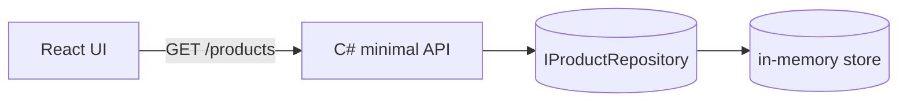

# Product Catalog — starter template

A minimal, working full-stack app: React (Vite) UI + C# minimal API, backed by
in-memory data. No Docker, no cloud account, no external services required —
built this way deliberately for Day 1 of the AI-Assisted Fullstack Engineering
program, which runs entirely on local laptops with no Azure access.

## Prerequisites

- .NET SDK 10.0+
- Node.js 20+

## Run it

**API** (from `Api/`):
```
dotnet run
```
Starts on `http://localhost:5080`. Confirm it's up: `curl http://localhost:5080/api/products`.

**UI** (from the repo root):
```
npm install
npm run dev
```
Starts on `http://localhost:5173` and proxies `/api/*` calls to the API above
— no CORS configuration needed in dev.

## Verify everything passes, before you change anything

```
dotnet test          # from repo root — runs Api.Tests via ProductCatalog.sln
npm test              # from repo root
npm run lint           # from repo root
```

All three should pass clean on a fresh clone. If any of them don't, something
about your local setup needs fixing before you start — not a sign the
requirement is broken.

# Project Overview: Product Catalog
A working product catalog. Browse products, see details — that's it, today.



### Screen

```
┌──────────────────────────────────────────────────┐
│  Product Catalog                                  │
├────────────────┬────────────────┬─────────────────┤
│  Trail Shoes    │  Water Bottle   │  Rain Jacket    │
│  $129.99        │  $24.50         │  $89.00         │
└────────────────┴────────────────┴─────────────────┘
```
## What's already here

- `Api/Features/Products/` — a working feature slice: model, repository
  interface, in-memory implementation, minimal API endpoints. This is the
  convention to follow for anything you add.
- `Api.Tests/Features/Products/` — unit tests on the repository, integration
  tests on the endpoints via `WebApplicationFactory<Program>`. Mirror this
  shape for new tests, don't invent a different pattern.
- `src/features/products/` — the same convention on the frontend: types,
  a thin `fetch` wrapper per endpoint, presentational components, tests
  using Testing Library with `fetch` mocked.

## Why in-memory instead of Cosmos DB

Day 1 has no Azure access. `IProductRepository` is written so a real
`CosmosProductRepository` can be added later via dependency injection —
mirroring a partition-key shape now — without changing the interface or any
endpoint code. That swap happens on Day 2.
